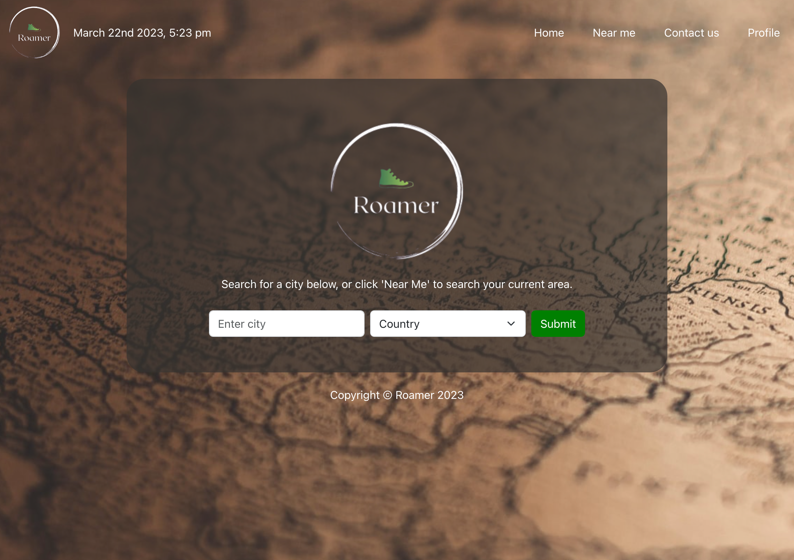

# Roamer

## Description

Roamer is a user-friendly travel guide app that helps users explore the local area with ease. With its navigation feature, users can easily find and navigate to their desired destinations. It provides users with accurate and up-to-date information on local weather, restaurants, hotels, buses, and much more based on users needs and interest. To create the best experience and help users make plans, the app provides the possibility to save favorite places to profile page. Whether you're a tourist or a local, Roamer is the perfect travel companion for exploring new places and creating unforgettable memories.

## Usage

### Home Page

On the Home page, users are presented with a user-friendly form that enables them to input the name of their desired city they wish to explore. Users must select the country to make the search more accurate. Upon submission of the form, the user is presented with an interactive map displaying the selected location, as well as current weather information. Additionally, users can browse for places of interest by selecting from a variety of pre-defined categories. Once the places markers are displayed on the map the user can find the shortest route from one place to another by selecting starting and finishing ponits on the map.

### Near Me

The "Near Me" page offers a "Find Me" button that allows users to access their current location map and weather information. Furthermore, users can explore places of interest by selecting from a diverse range of pre-defined categories. Once the places markers are displayed on the map the user can find the shortest route from one place to another by selecting starting and finishing ponits on the map.

### Contact Us

The "Contact Us" page features a user feedback form, allowing individuals to share their thoughts and comments regarding the application.

### Proile

On the "Profile" page, users are given the option to register for an account. Once registered, users can log in and utilize a feature to save the places they have discovered while using the app. These saved places are stored in the local storage and can be viewed or removed later from personalized "Profile" page. Additionally, on the "Profile" page users can upload up to six personal images.

The deployed application can be found here: https://roamer.netlify.app/

## Collaborators

- [Hayley Blackburn](https://github.com/codenamehaylz)
- [Ieva Baranauskaite](https://github.com/1Eva1987)
- [Desislava Ivanova](https://github.com/DessySI)
- [Marta Perlinska](https://github.com/Nulula)

## Technologies Used:

- ReactJS
- NodeJS
- JavaScript
- Bootstrap
- React-router-dom
- React-toastify
- Emailjs
- Moment
- Axios

## API’s Third Party:

- Leaflet
- Geoapify
- Weather

## License

MIT
